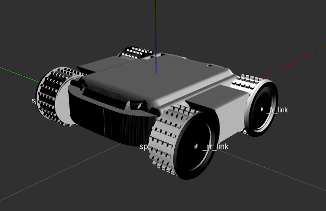
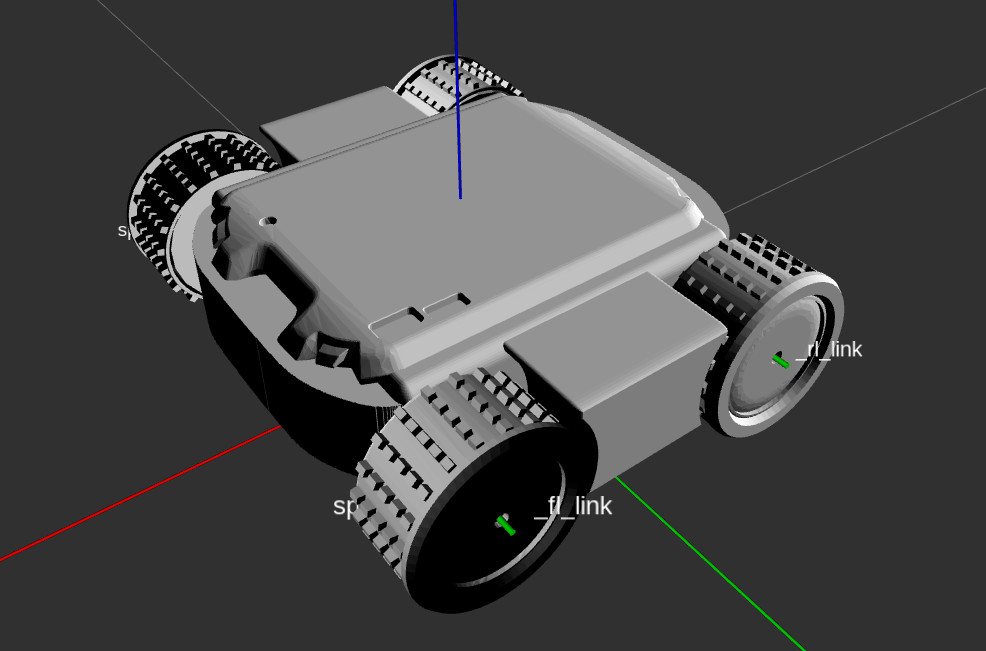

# Sphero RVR

This ros modules contain an experimental ROS Node for the Sphero RVR.
The cpp version is based on Rud Merriam's "RVR CPP" https://bitbucket.org/rmerriam/rvr-cpp/src/master/ (see sphero_rvr_hw/src/base_controller.cpp). The python3 version is based on the official Sphero RVR Pyhton SDK (see sphero_rvr_hw/scripts/rvr-ros.py)
Both version use /cmd_vel and publish to odom.
Note: Currently only the python version is supported.

## Setup
This project is distributed into several subprojects.
All those dependencies are included by [vcstool](https://github.com/dirk-thomas/vcstool) and listed in `ros-sphero-rvr.repos`.
After installation you can clone all repositories by calling `vcs import . --input ros-sphero-rvr/ros-sphero-rvr.repos`
from the same location as where you have cloned this repository.
During production you can update all repositories by calling `vcs pull` from your repository root location.
See `vcs help` for further information.

## Startup

- Make sure that the robot is turned on
- To run the python version
 ```
 roslaunch sphero_rvr bringup_rvr_in_world.launch robot_name:=<unique robot name> as_simulation:=<true_if_simulation> as_visualization:=<true_if_only_rviz_visualization> run_rviz:=<true_if_rviz_should_be_started>
 ```
- If you wan't to integrate the platform into a more complex robot you may wan't to include `bringup_rvr.launch` into your global launch file instead.
- Note! The cpp version is not supported so far

## ROS Integration
### Topics
- **/cmd_vel** (topic) to give the platform realtime motor commands (for testing you could use rqt). 
Use linear.x for driving forwards/backwards [m/s^2] and angular.z to rotate around the rvr's center rotation axis [rad/s].
Note that this realtime motor commanding is only estimating the given velocities by a large error. 
Use other services if you need a more exact motion.
The rvr would stop after two seconds of no command sent, however, we have reduced this to 0.3 seconds for a faster reaction.

- **/color** (topic) the sensed rgb color and the corresponding certainty.
Note that a service call is once needed to activate this sensor.

- **/ambient_light** (topic) the sensed ambient light.

- **/magnet** (topic) the rotation to the magnetic north as PoseStamped. 
Note that you need to calibrate the magnetic sensor in order to receive messages on this topic.

- **/is_emergency_stop** (topic) to trigger an emergency stop. See below for more information.


### Services
- **/move_to_pose** (service) to move the platform to a specific position [m] and rotation [rad].
In header the frame of the given pos can be set and will be transformed by tf2 automatically.
In pose the x and y positions can be set. The x-axis is pointing to the robots forward direction 
(TODO currently this is not the case. The y-axis is pointing to the forward direction. However, this is a bit unusual so it should be changed)
In pose a rotation around the platforms z-axis can be given (in quaternions).
While the rotation speed is fixed, the linear speed can be given as speed.
If speed_in_si is true the speed is interpreted as [m/s], otherwise as a value between [0..128].
If the speed is negative the rvr will drive backwards.

- **/move_to_pos_and_yaw** (service) to move the platform to a specific position [m] and yaw rotation [rad].
This is the same implementation as the move_to_pose service except that the rotation is given as extra yaw value (which is more intuitive than quaternions).

- **/enable_color** (service) enables/disables the color sensor at the bottom of the robot.
The sensed rgb color is then published on a separate topic.

- **/set_leds** (service) sets the color of all leds to the given rgb value.

- **/battery_state** (service) returns the battery percentage and volt state (available volt states are [unkown, ok, low, critical]).

- **/calibrate_magnetometer** (service) a routine to calibrate the magnetometer is started.
This lets the rvr spin around the z-axis by 360 degree.
 
- **/reset_odom** (service): Reset the odom of the rvr to the current location. This is also releasing the emergency stop.

- **/release_emergency_stop** (service): Release the emergency stop. See below for more information.

- **/trigger_led_event** (service): Starts/Releases a predefined led event. See below for more information.


## Emergency Stop
There is a feature to stop the rvr in case of an emergency.
This will stop and disable all further movement until the rvr is restarted/reset or the emergency stop is released by a service call to **rvr/release_emergency_stop**.
An emergency stop can be triggered by publishing to the topic **rvr/is_emergency_stop**.
The current value of the emergency stop can be read from the param server **rvr/emergency_stop**.
There is also an implementation to use the realsense2 camera depth data to trigger an stop if any object is too close to the rvr.
However, this feature is only enabled if the `with_camera` argument is set at the rvr top level launch file.

## Color Picker
In `rvr_tools.py` the implementation of a rvr led handling tool can be found.
The tool is already integrated to the rvr hw main file.
All led control of the rvr should be integrated there.
Apart from a service to custom change the led color the centerpiece is an event management tool.
The main idea is that led events, to show eg. that the rvr has successfully started, can be triggered by a service.
Each event is linked to a predefined color animation.
There are two type of events, asynchronous will static change the color, but trigger a predefined routine when (service based) released.
Synchronous events result in a one time animation, but without the need to release the event.

## Multi Robot Support
To support the usage of multiple robots within the same server, each robot has to be namespaced during startup by the `ns` param.
This will namespace every topic and also remap the /tf topic to this namespace.
Within the namespace it will be like there is only one single robot, so the standard tf frames can be used and the rviz visualization will work for a single robot.
If multiple robots should be visualized at the same time or position data needs to be transferred between two robots there is a tf2_relay node that is transferring tf data to the global /tf topic.
The realyed tf data will be namespaced such that multiple robots with the same description fit into the same topic.

## Navigation
Make sure to enable the `pub_odom_as_tf` argument when starting the rvr.
This revents the odom node to publish a separate tf which is needed when an external tool, eg. ekf is handling the tf publish of the odom frame.


## Known issues
- Don't use the quaternion rotation provided by the platform. Instead, access the IMU data directly and convert the angles (in degree) to quaternion.
It seems like sphero has done a bad job by converting the IMU data to quaternion.

- Initializing the sensor streams has to be done every time the rvr is woken up.
  However, this routine and falling/waking from soft sleep in general seems to crash the serial connection to the rvr sometimes and so shouldn't be called too often.
  We prevent the rvr from falling into soft sleep so that this just has to be called during startup.

- Sending multiple command through the serial port can lead to "flooding" of the port and to a crash of the serial connection.
  We overcome this by waiting .1 seconds after each command as suggested here 

- In the URDF the wheel joints are set to fixed. This is because there is no way to control the joints directly and so publishing joint states is not needed.

- If the startup gets stuck during the firmware check this is usually a problem of your serial communication.
Notice that if the transmission is working but the receive not your robot will eg. move but the firmware check will not finish.
If your cable works fine check if nvgetty is running on the jetson and disable it if so.

## TODO
- [ ] Fix the cpp version (currently only the python version is supported)

## More Information:




- [x] This repository is build upon: https://github.com/strean/rvr_ros and the free Sphero RVR CPP library from https://bitbucket.org/rmerriam/rvr-cpp.
  - [x] Basic control from Nvidia Jetson (directly via ``/dev/ttyTHS1``)
  - [x] Basic ROS Control (actually no one till now wrote a real ROS Controller)
    - [x] Python Version of Basic ROS Controller (rosrun sphero_rvr_hw rvr-ros.py) 
    - [x] C++ Version of Basic ROS Controller (roslaunch sphero_rvr_hw rvr_ros.launch)
    - [x] C++ Version ROS Controller (Build upon URDF; Velocity Control)  
      - [ ] Still an Issue with https://bitbucket.org/rmerriam/rvr-cpp library> sensors_s.locator() for odometry does not stream data.
      - [ ] There is no way to get the motor currentor motor velocity from the SPhero RVR - so the classical ROS Controller read part is not working
  - [x] Build URDF Model (v0.1)
  - [x] Extend rvr_ros to publish all sensor data
  - [x] Write ros service calls to set e.g. led colors
- [x] ROS Noetic does not provide ros-noetic-serial - this is build from https://github.com/wjwwood/serial. (Note: this is not the rosserial library)
- [ ] At a later stage we might have a look at the ROS2 implementation from lomori: https://github.com/lomori/spherorvr-ros2

**Note:** To build rvr-cpp you need at least gcc version 9.
